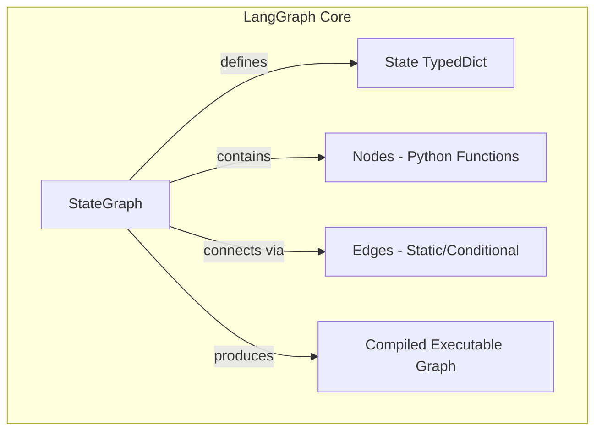
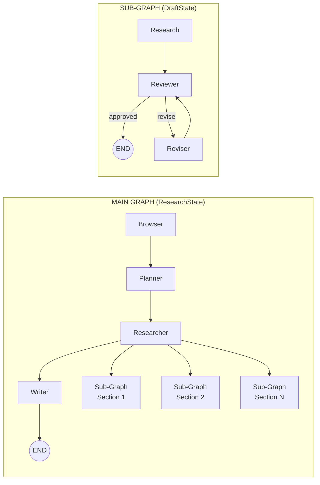
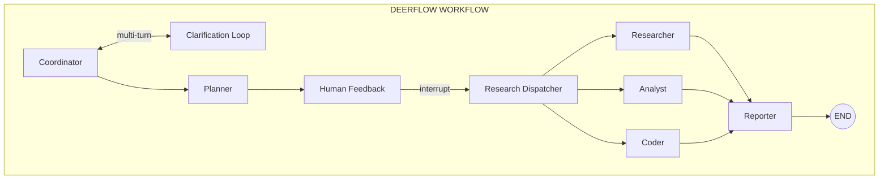
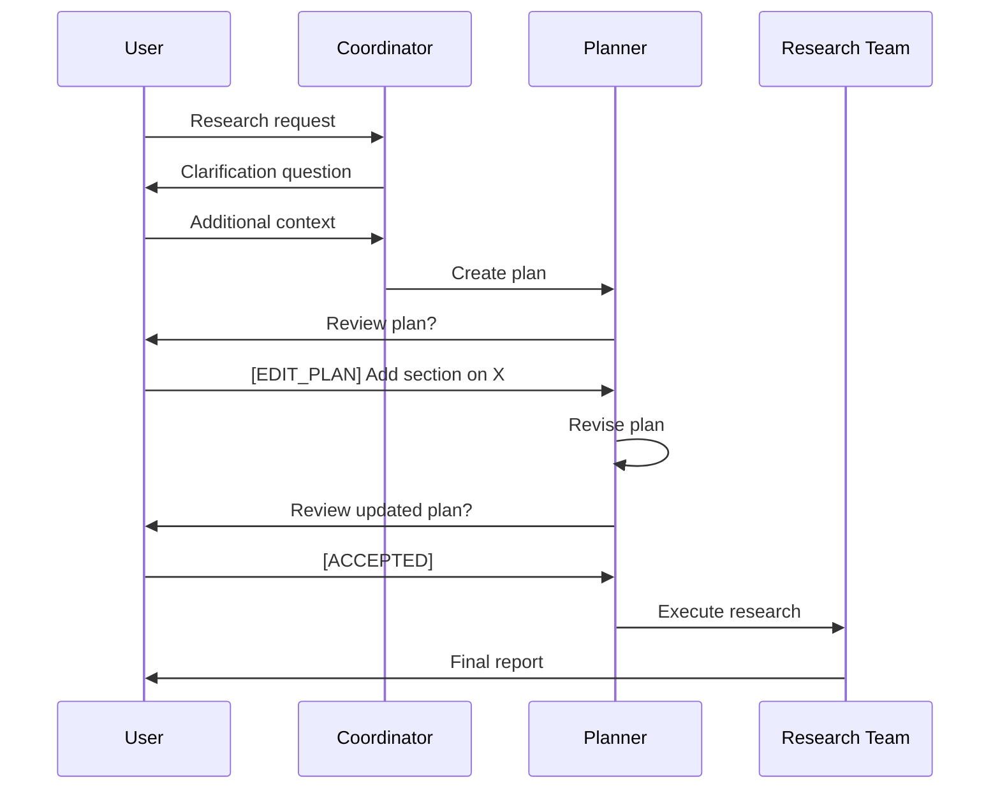
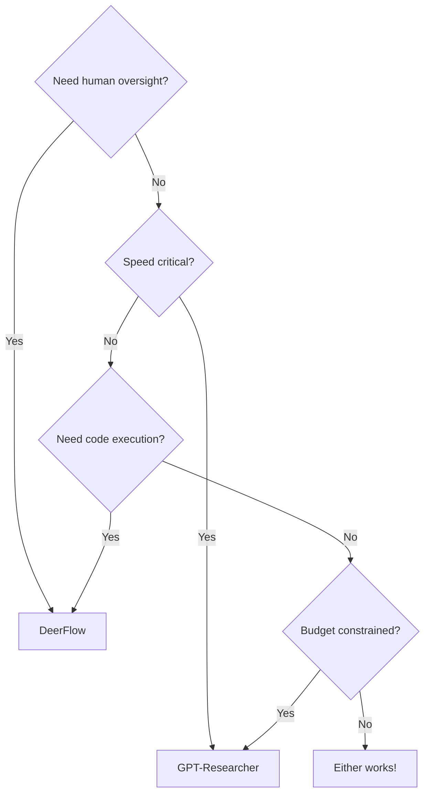

# Agentic Workflow Showdown: GPT-Researcher vs DeerFlow

Building AI agents that can research, reason, and produce quality reports is one of the hottest challenges in 2026. Two frameworks have emerged as leaders: **GPT-Researcher** and **DeerFlow** (by ByteDance). Both use LangGraph for orchestration, but their architectural approaches couldn't be more different.

I spent a week diving deep into both codebases. Here's what I found.

---

## Table of Contents

1. [TL;DR](#tldr)
2. [The LangGraph Foundation](#the-langgraph-foundation)
3. [GPT-Researcher: The Parallel Machine](#gpt-researcher-the-parallel-machine)
4. [DeerFlow: The Collaborative Researcher](#deerflow-the-collaborative-researcher)
5. [Head-to-Head Comparison](#head-to-head-comparison)
6. [When to Use Which](#when-to-use-which)
7. [Architectural Lessons](#architectural-lessons)

---

## TL;DR

| Aspect | GPT-Researcher | DeerFlow |
|--------|----------------|----------|
| **Pattern** | Nested parallel graphs | Flat dispatcher |
| **Speed** | ~3 min (parallel) | Variable (sequential) |
| **Human Loop** | Minimal | Deep integration |
| **Best For** | Fast autonomous research | Collaborative exploration |

---

## The LangGraph Foundation

Both frameworks build on **LangGraph**, LangChain's extension for stateful multi-agent applications. The core concepts:



But how each framework *uses* these primitives reveals fundamentally different philosophies.

---

## GPT-Researcher: The Parallel Machine

### Architecture: Graph-Within-Graph

GPT-Researcher implements a **nested graph pattern** — a main graph spawns sub-graphs for parallel section research:



Each sub-graph has its own **DraftState** with a review-revise loop:

```python
# Sub-graph with conditional edges
sub_workflow.add_conditional_edges(
    "reviewer",
    lambda state: "accept" if state["review"] == "approved" else "revise",
    {"accept": END, "revise": "reviser"}
)
sub_workflow.add_edge("reviser", "reviewer")  # Loop back
```

### Why This Works

1. **Isolation** — Each section gets its own state, preventing race conditions
2. **Parallelism** — All sub-graphs run concurrently
3. **Quality Control** — Built-in review cycle catches issues early
4. **Speed** — ~3 minutes for a full research report

### The Agent Lineup

| Agent | Role | Superpower |
|-------|------|------------|
| GPT-Researcher | Deep research | Web scraping, source aggregation |
| Editor | Planning | Outline structure |
| Reviewer | QA | Validates against guidelines |
| Reviser | Refinement | Incorporates feedback |
| Writer | Compilation | Introduction, conclusion |
| Publisher | Export | PDF, Docx, Markdown |

---

## DeerFlow: The Collaborative Researcher

### Architecture: Flat Graph with Dispatcher

DeerFlow takes the opposite approach — a **single flat graph** with a central dispatcher routing to specialists:



### The Command Pattern

DeerFlow uses LangGraph's `Command` objects instead of conditional edges:

```python
from langgraph.types import Command

def coordinator_node(state: State) -> Command:
    if needs_clarification(state):
        return Command(
            update={"clarification_round": state["clarification_round"] + 1},
            goto="coordinator"  # Loop back
        )
    elif is_research_request(state):
        return Command(
            update={"research_topic": extract_topic(state)},
            goto="planner"
        )
    else:
        return Command(goto=END)
```

This gives explicit, readable control flow versus implicit conditional edge logic.

### Human-in-the-Loop Done Right

DeerFlow's killer feature is deep human integration:



1. **Clarification Loop** — "What specifically about X do you want to know?"
2. **Plan Approval** — Human reviews the research plan before execution
3. **Plan Editing** — Natural language edits: "Add a section on Y"
4. **Tool Oversight** — Approval for sensitive operations

```python
from langgraph.types import interrupt

def human_feedback_node(state: State) -> Command:
    feedback = interrupt({
        "plan": state["current_plan"],
        "message": "Please review the research plan"
    })
    
    if feedback.startswith("[ACCEPTED]"):
        return Command(goto="research_team")
    elif feedback.startswith("[EDIT_PLAN]"):
        return Command(goto="planner")
```

### The Agent Lineup

| Agent | Role | Tools |
|-------|------|-------|
| Coordinator | Entry/routing | Intent classification |
| Planner | Task decomposition | None (pure LLM) |
| Researcher | Information gathering | web_search, crawl, RAG |
| Analyst | Reasoning/synthesis | None (pure LLM) |
| Coder | Data processing | python_repl |
| Reporter | Report generation | None (pure LLM) |

---

## Head-to-Head Comparison

### State Management

```python
# GPT-Researcher: Dual state, isolated sub-graphs
class ResearchState(TypedDict):    # Main graph
    task: dict
    sections: List[str]
    report: str

class DraftState(TypedDict):       # Sub-graph (per section)
    topic: str
    draft: dict
    review: str

# DeerFlow: Single unified state
class State(MessagesState):
    messages: Annotated[list, add_messages]  # Automatic history
    research_topic: str
    current_plan: Optional[Plan]
    observations: List[str]
    final_report: str
```

GPT-Researcher's dual state enables parallelism but adds complexity. DeerFlow's unified state is simpler but requires careful preservation.

### Parallelism vs Sequential

| Aspect | GPT-Researcher | DeerFlow |
|--------|----------------|----------|
| **Approach** | Multiple sub-graphs | Single dispatcher |
| **Concurrent Agents** | Yes | No |
| **Race Conditions** | Prevented by isolation | N/A (sequential) |
| **Time to Complete** | ~3 min | Variable (human dependent) |

### LangGraph Feature Usage

| Feature | GPT-Researcher | DeerFlow |
|---------|----------------|----------|
| StateGraph | ✅ | ✅ |
| Nested Graphs | ✅ | ❌ |
| Conditional Edges | ✅ Primary | ✅ Secondary |
| Command Objects | ❌ | ✅ Primary |
| MessagesState | ❌ | ✅ |
| Interrupt (HITL) | ❌ | ✅ |
| Checkpointing | ❌ | ✅ |

---

## When to Use Which



### Choose GPT-Researcher when:

- ⚡ Speed matters (~3 min vs variable)
- 💰 Cost is a concern (~$0.10/research)
- 🤖 You want autonomous execution
- 📊 You need parallel processing
- 🔌 Simple integration is preferred

### Choose DeerFlow when:

- 🧑‍💼 Research requires human guidance
- ❓ Multi-turn clarification is needed
- 🐍 Code execution is required
- 📚 You have existing RAG infrastructure
- 🎨 You need TTS/PPT generation
- 🔧 Extensive customization matters

---

## Architectural Lessons

Building these systems taught me several principles:

1. **State isolation enables parallelism** — GPT-Researcher's sub-graph pattern is elegant
2. **Commands > conditional edges for complex routing** — DeerFlow's explicit `goto` is more readable
3. **Human-in-the-loop is a feature, not a fallback** — DeerFlow's interrupt points add real value
4. **MessagesState simplifies conversation tracking** — Automatic history management is worth adopting

---

## What's Next

Both frameworks continue to evolve. GPT-Researcher just added support for local LLMs, while DeerFlow is expanding its MCP protocol integration. The agentic research space is heating up.

For our projects at BlestLabs, we're experimenting with a hybrid approach — using GPT-Researcher's parallel pattern for bulk research, with DeerFlow-style human checkpoints for quality-critical sections.

---

## Sources

- [GPT-Researcher Documentation](https://docs.gptr.dev/)
- [GPT-Researcher LangGraph Blog](https://docs.gptr.dev/blog/gptr-langgraph)
- [DeerFlow System Architecture](https://deepwiki.com/bytedance/deer-flow/2-system-architecture)
- [LangGraph Documentation](https://docs.langchain.com/oss/python/langgraph/graph-api)

---

*Have questions or want to discuss multi-agent architectures? Reach out on [Twitter @aceism_](https://twitter.com/aceism_) or check out our other [research posts](/blog).*

---

## Related Posts

- [AI Agents vs ChatGPT Wrappers: How to Build Products That Actually Work](/blog/ai-agents-vs-wrappers)
- [How to Build a Multi-Agent AI System: Mac + Raspberry Pi](/blog/multi-agent-system-alfred-pip)
- [How to Run Multiple AI Bots in Discord](/blog/discord-multi-bot-brainstorm)

---

## About the Author

**BlestLabs** builds AI-powered tools and agents. We run multiple AI agents 24/7 including Alfred (Mac Mini) and Pip (Raspberry Pi) for research, automation, and monitoring. Follow our journey on [Twitter](https://twitter.com/aceism_).
