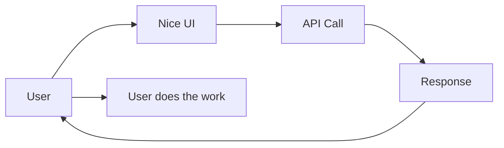
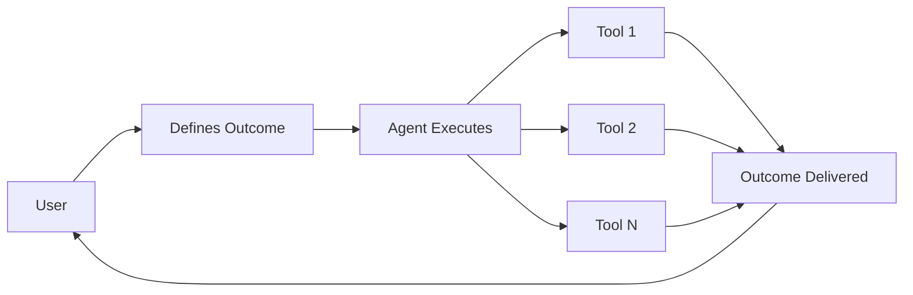
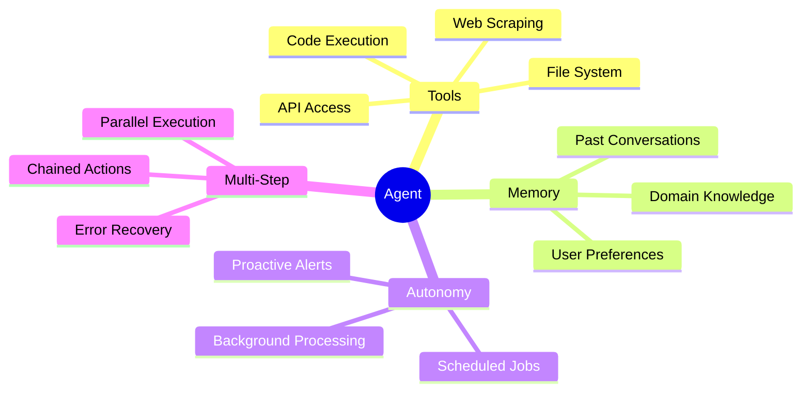
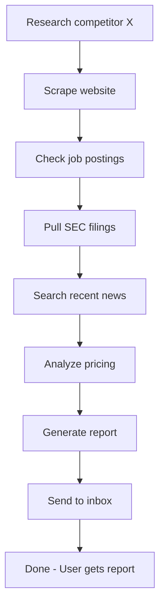
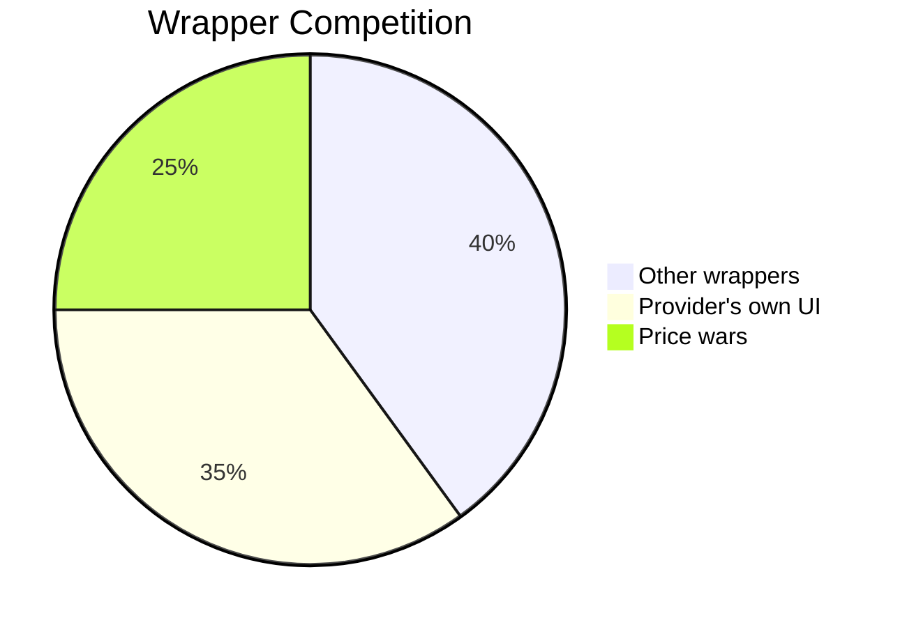
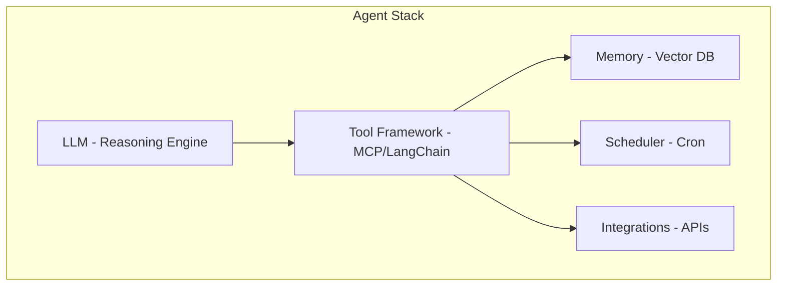
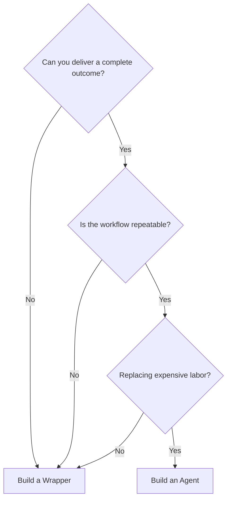

# AI Agents vs AI Wrappers: Why Outcomes Beat Tools

Everyone's building AI products in 2026. But there's a massive difference between building a **wrapper** (UI around an API) and building an **agent** (something that completes work).

Here's the framework I use to think about AI product opportunities.

---

## Table of Contents

1. [The Wrapper Trap](#the-wrapper-trap)
2. [The Agent Difference](#the-agent-difference)
3. [What Makes an Agent?](#what-makes-an-agent)
4. [The Business Case](#the-business-case)
5. [High-Value Agent Ideas](#high-value-agent-ideas)
6. [When to Build Which](#when-to-build-a-wrapper)

---

## The Wrapper Trap

Most "AI products" are wrappers:



Examples:
- Chat interface with GPT
- "Write my email" button
- AI writing assistant
- Image generator with presets

**The problem:** The user still does the work. The AI just... helps.

---

## The Agent Difference

Real agents complete workflows:



Examples:
- "Monitor my competitors and alert me on changes" → Weekly intelligence report appears
- "Research this company" → Full due diligence document generated
- "Keep my crypto portfolio balanced" → Trades executed, alerts sent

**The difference:** The user gets outcomes, not assistance.

---

## Side-by-Side Comparison

| Wrapper | Agent |
|---------|-------|
| API call → response | Multi-step execution with real tools |
| User does the work | Agent completes the workflow |
| Chat interface | Background jobs, scheduled tasks |
| Generic AI | Domain-specific with context |
| Stateless | Persistent memory |
| Manual trigger | Proactive alerts and actions |

---

## What Makes an Agent?



### 1. Tool Access

Agents need to *do* things, not just *say* things:

```python
# Wrapper
response = llm.chat("What's the weather?")
# Returns: "I don't have access to weather data..."

# Agent
response = agent.run("What's the weather?")
# Calls weather API, returns: "72°F and sunny in NYC"
```

### 2. Memory

Agents remember context across sessions:

```python
# Wrapper - every conversation starts fresh
"Who am I?" → "I don't know, you haven't told me"

# Agent - persistent memory
"Who am I?" → "You're ACe, you prefer bullet points, 
               your portfolio is 60% BTC, you're on H1B visa"
```

### 3. Autonomy

Agents work without constant prompting:

```python
# Wrapper - needs user to trigger every action
user: "Check if BTC dropped"
assistant: "BTC is at $70,000"

# Agent - proactive monitoring
[4:00 AM Alert] "BTC dropped 15% to $60K. 
This is below your $65K buy trigger. 
Recommend deploying $100 USDC per your strategy."
```

### 4. Multi-Step Execution



---

## The Business Case

### Wrappers Compete on UI



When you build a wrapper, you're competing with:
- Every other wrapper using the same API
- The API provider's own interface (ChatGPT, Claude.ai)
- Price (race to bottom)

**Moat:** Basically none. Anyone can copy your prompts.

### Agents Compete on Outcomes

When you build an agent, you're competing with:
- Human labor (analysts, researchers, assistants)
- Existing enterprise software
- Time (the user's most valuable resource)

**Moat:** Domain expertise, integrations, data flywheel.

---

## High-Value Agent Ideas

| Agent | Price | Replaces |
|-------|-------|----------|
| **Competitive Intelligence** | $200-500/mo | $60K+/year analyst |
| **Due Diligence** | $500-2000/report | Associate @ $200/hr |
| **Research Synthesis** | $100-300/mo | Weeks of manual review |
| **Lead Research** | $0.50-2/lead | Hours of manual research |

### 1. Competitive Intelligence Agent
- Monitors competitor websites, job postings, SEC filings
- Sends weekly intelligence briefings
- Alerts on significant changes

### 2. Due Diligence Agent
- Takes company name → full research report
- Pulls financials, news, patents, lawsuits
- Generates investor memo format

### 3. Research Synthesis Agent
- Takes research question → literature review
- Queries academic databases, synthesizes findings
- Monitors for new papers, sends alerts

### 4. Lead Research Agent
- Takes prospect list → enriched profiles
- Pulls LinkedIn, news, funding, tech stack
- Generates personalized outreach suggestions

---

## The Stack That Makes It Possible



| Component | Purpose | Example |
|-----------|---------|---------|
| **LLM** | Reasoning engine | Claude, GPT-5 |
| **Tool Framework** | Action execution | MCP, LangChain |
| **Memory** | Persistent context | Vector DB, structured storage |
| **Scheduler** | Autonomous triggers | Cron, event-driven |
| **Integrations** | External data/actions | APIs, web scraping |

Our stack at BlestLabs:
- **OpenClaw** — Agent orchestration with tool access
- **Claude Opus** — Primary reasoning model
- **MCP Servers** — Domain-specific tools (finance, research, etc.)
- **Scheduled jobs** — Proactive monitoring and alerts
- **Multi-agent** — Specialized agents that collaborate

---

## When to Build a Wrapper

Wrappers aren't always bad. Build one when:

- ✅ You're learning/experimenting
- ✅ The UI itself IS the value (accessibility, mobile, niche)
- ✅ You're building a feature, not a product
- ✅ Time-to-market matters more than defensibility

## When to Build an Agent

Build an agent when:

- ✅ You can deliver complete outcomes
- ✅ The workflow is repeatable and valuable
- ✅ You have domain expertise to encode
- ✅ You're replacing expensive human labor
- ✅ You want a defensible business

---

## Decision Framework



---

## The Bottom Line

The AI product landscape in 2026 is splitting:

**Wrappers:** Race to commoditization. Competing on UI and price.

**Agents:** Competing on outcomes. Replacing expensive labor. Building moats.

If you're starting an AI company, ask yourself: **Am I building a tool, or am I delivering an outcome?**

The answer determines your ceiling.

---

## Related Posts

- [LangGraph Tutorial: GPT-Researcher vs DeerFlow](/blog/agentic-workflow-langgraph-comparison)
- [How to Build a Multi-Agent AI System](/blog/multi-agent-system-alfred-pip)
- [How to Run an AI Agent on Raspberry Pi 24/7](/blog/openclaw-raspberry-pi-setup)

---

## About the Author

**BlestLabs** builds AI-powered tools and agents. We run multiple AI agents 24/7 for research, automation, and monitoring. Follow our journey on [Twitter @aceism_](https://twitter.com/aceism_).
