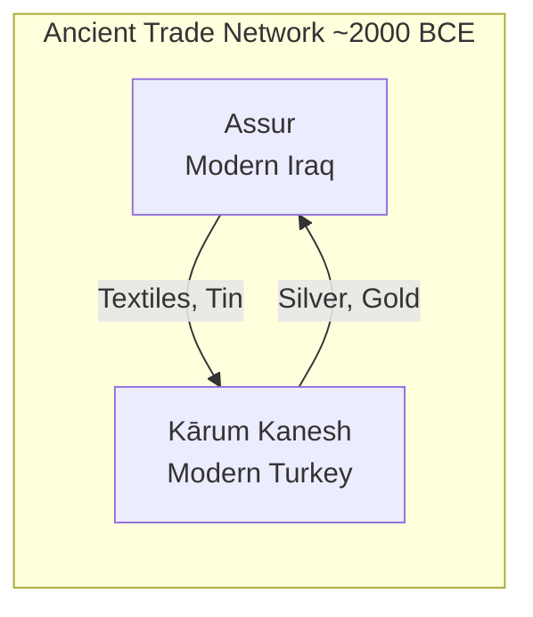
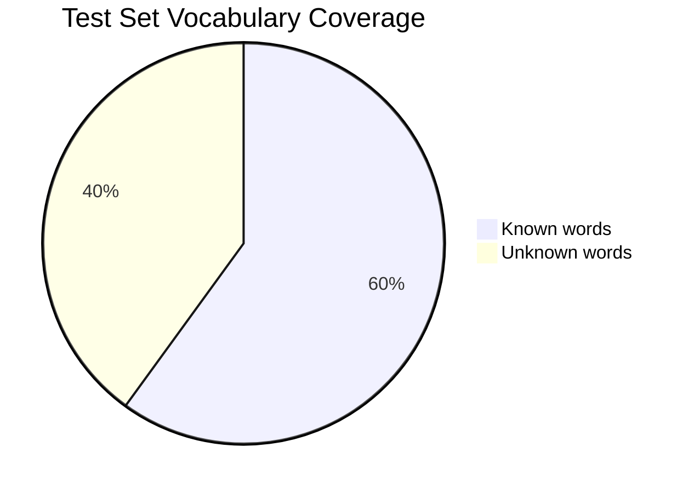
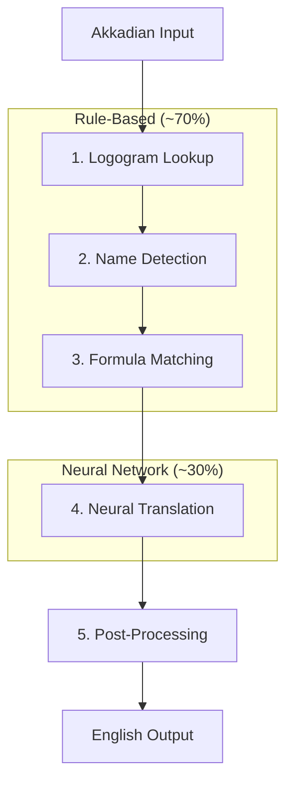

# Using AI to Translate 4,000-Year-Old Mesopotamian Tablets

Somewhere in museum storage rooms around the world, over 22,000 clay tablets sit unread. They were written 4,000 years ago by merchants who built the world's first international trade network. The problem? **Fewer than 20 people alive today can read them.**

We're trying to change that with AI.

---

## Table of Contents

1. [The Story Behind the Tablets](#the-story-behind-the-tablets)
2. [What the Language Looks Like](#what-the-language-looks-like)
3. [Why This is Hard for AI](#why-this-is-hard-for-ai)
4. [Our Hybrid Approach](#our-hybrid-approach)
5. [Results So Far](#results-so-far)
6. [What's Next](#whats-next)

---

## The Story Behind the Tablets

Around 2000-1700 BCE, merchants from the ancient city of **Assur** (in modern-day Iraq) built a massive trade network stretching across the Middle East. They traded tin, textiles, and silver with cities as far away as modern-day Turkey.



These merchants were meticulous record-keepers. They wrote everything on **clay tablets** using cuneiform (wedge-shaped marks pressed into wet clay):

- Business contracts
- Loans and debts
- Personal letters
- Receipts
- Legal documents

**The treasure trove:** Over 22,000 tablets have been discovered, but most sit untranslated because there simply aren't enough scholars who can read them.

---

## What the Language Looks Like

The tablets are written in **Akkadian**, specifically the "Old Assyrian" dialect. Here's how the translation pipeline works:

### Step 1: Original Cuneiform

```
𒆠𒅆𒅁 𒈠𒉡𒁀𒇻𒀀𒋗𒌨
```

We don't work with this directly — scholars have already transcribed the wedge marks into Latin letters.

### Step 2: Transliteration (Our Input)

```
KIŠIB ma-nu-ba-lúm-a-šur DUMU ṣí-lá-(d)IM
```

This is what the AI receives. Let me break it down:

| Symbol | Meaning |
|--------|---------|
| `KIŠIB` | Logogram for "seal" (one symbol = whole word) |
| `ma-nu-ba-lúm-a-šur` | Personal name "Mannum-balum-Aššur" |
| `DUMU` | Logogram for "son" |
| `(d)IM` | The god Adad (divine determinative) |

### Step 3: English Translation (Our Output)

```
Seal of Mannum-balum-Aššur son of Ṣilli-Adad
```

### Real Examples

Here are actual translations from our training data:

**Example 1: A Debt Record**
```
Input:  1 TÚG ša qá-tim i-tur₄-DINGIR il₅-qé
Output: Itūr-ilī has received one textile of ordinary quality.
```

**Example 2: A Financial Transaction**
```
Input:  10 ma-na KÙ.BABBAR a-na ša-lim-a-šùr i-dí-in
Output: He gave 10 minas of silver to Šalim-Aššur.
```

**Example 3: A Legal Document**
```
Input:  KIŠIB šu-(d)EN.LÍL DUMU šu-ku-bi-im
Output: Seal of Šu-Illil son of Šu-Kūbum
```

---

## Key Symbols You'll See

| Symbol | Meaning | Example |
|--------|---------|---------|
| `UPPERCASE` | Logogram (one symbol = word) | `DUMU` = "son" |
| `-` | Connects syllables | `ma-nu-ba-lúm` |
| `{d}` | God name follows | `{d}IM` = god Adad |
| `(ki)` | Place name | `kà-ni-ia(ki)` = Kanesh |
| `KÙ.BABBAR` | Silver ("shiny white") | Common in trade texts |
| `GÍN` | Shekel (~8 grams) | Currency unit |
| `ma-na` | Mina (60 shekels, ~500g) | Weight unit |
| `x` | Damaged/unreadable | Broken tablet |

---

## Why This is Hard for AI

### 1. Tiny Dataset

We have only **1,561 training examples**. For comparison:

| Translation Task | Training Data |
|------------------|---------------|
| Google Translate | Billions of sentences |
| Modern NMT models | Millions of sentences |
| **Our Akkadian task** | **1,561 sentences** |

### 2. 40% Unknown Words in Test

Many words in the test set don't appear in training. It's like being asked to translate French, but 40% of the words are brand new.



### 3. Damaged Texts

Ancient tablets are often broken:

```
x x x a-na ša-lim-a-šùr x x
(... to Šalim-Aššur ...)
```

The AI must work around missing pieces.

### 4. Names Everywhere

Personal names, god names, place names — they're everywhere and often get mangled:

- `A-šùr-i-mì-tí` = "Aššur-imittī" (meaning "Aššur is my support")
- `PUZUR₄-a-šur` = "Puzur-Aššur" (a common name)

### 5. No Native Speakers

Unlike French or Spanish, there's no one alive who grew up speaking Akkadian to verify translations.

---

## Our Hybrid Approach

Pure neural networks struggle with this task. Instead, we built a **hybrid pipeline** that mimics how human Assyriologists work:



### Why Hybrid Works

Our analysis showed:

| Component | Training Coverage | Test Coverage |
|-----------|------------------|---------------|
| Logogram lookup | 19.7% | 20.9% |
| Name detection | 5.4% | Varies |
| Formula matching | 15.0% | Limited |
| Lexicon coverage | 81.5% | 57.6% |
| **Neural needed** | **15.6%** | **31.1%** |

**Key insight:** Only 15-31% truly needs neural translation. The rest can be handled with rules and lookups.

### The Components

**1. Logogram Lookup**
Logograms like `DUMU` (son) and `KIŠIB` (seal) have fixed meanings. We look them up directly.

**2. Name Detection**
Names follow patterns. When we see `DUMU X` (son of X), we know X is a name and should be transliterated, not translated.

**3. Formula Matching**
Business documents are formulaic. Debt records start similarly, seals follow templates.

**4. Neural Translation**
For the remaining ~30%, we use a fine-tuned mT5 model (multilingual text-to-text transformer).

**5. Post-Processing**
Fix common errors, normalize punctuation, handle edge cases.

---

## Results So Far

| Approach | Score | Notes |
|----------|-------|-------|
| Just copy input (baseline) | 4.01 | Lower bound |
| Dictionary lookup only | 25.49 | Surprisingly good |
| Pure fuzzy matching | 25.85 | Best non-neural |
| mT5-small neural | 12.90 | Underperforms baselines! |
| **Hybrid + Neural** | **25.87** | **Best overall** |

**Surprising finding:** Pure neural approaches performed *worse* than simple dictionary lookup. The small dataset and high OOV rate break modern NMT models.

---

## What We're Translating

Here's an actual test document we need to translate:

```
um-ma kà-ru-um kà-ni-ia-ma a-na aa-qí-il… da-tim
aí-ip-ri-ni kà-ar kà-ar-ma ú wa-bar-ra-tim qí-bi„-ma
mup-pu-um aa a-lim(ki) i-li-kam
```

This appears to be an official message from the **kārum** (merchant colony) of **Kanesh** — an ancient trading post in Turkey. The `…` indicates damaged text.

---

## Why This Matters

If we succeed:

1. **Historical impact** — Help translate thousands of untranslated tablets
2. **Academic value** — Give scholars a tool to work faster
3. **Cultural preservation** — Make 4,000-year-old voices accessible
4. **Technical achievement** — Solve a genuinely hard AI problem

These merchants were real people with real problems. Their letters contain things like:

> *"Why haven't you sent the silver you promised?"*

> *"Your brother cheated me in the textile trade"*

> *"Send more tin before the caravan leaves"*

We're trying to let them speak again after 4,000 years of silence.

---

## Technical Stack

| Tool | Purpose |
|------|---------|
| Python | Data processing |
| Hugging Face Transformers | Neural model |
| mT5-small | Multilingual encoder-decoder |
| Kaggle GPUs | Training (our local hardware is too weak) |
| Custom lexicon matcher | Dictionary lookups |

---

## What's Next

The competition deadline is **March 23, 2026**. We're currently:

1. Improving name detection patterns
2. Expanding formula matching coverage
3. Experimenting with larger neural models
4. Fine-tuning on domain-specific pretraining

The $50,000 prize would be nice, but the real reward is helping unlock human history.

---

## Want to Learn More?

- [Kaggle Competition: Deep Past Challenge](https://www.kaggle.com/competitions/deep-past-challenge)
- [Akkadian Language Wikipedia](https://en.wikipedia.org/wiki/Akkadian_language)
- [Digital Corpus of Cuneiform Lexical Texts](https://dclt.orinst.ox.ac.uk/)

---

## Related Posts

- [LangGraph Tutorial: GPT-Researcher vs DeerFlow](/blog/agentic-workflow-langgraph-comparison)
- [AI Agents vs ChatGPT Wrappers](/blog/ai-agents-vs-wrappers)

---

## About the Author

**BlestLabs** builds AI-powered tools and explores unconventional applications of machine learning. Follow our journey on [Twitter @aceism_](https://twitter.com/aceism_).
