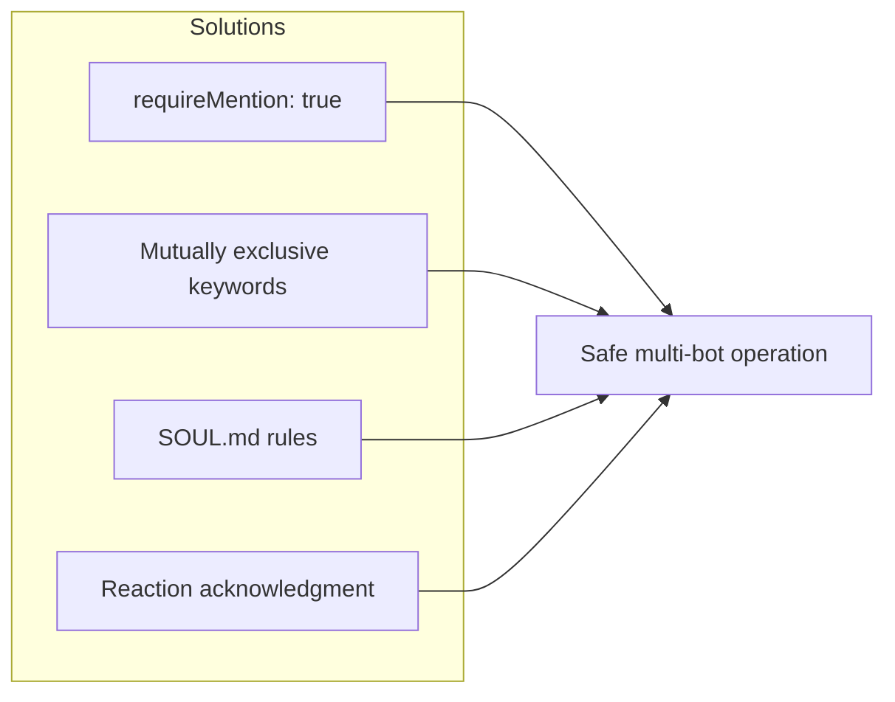
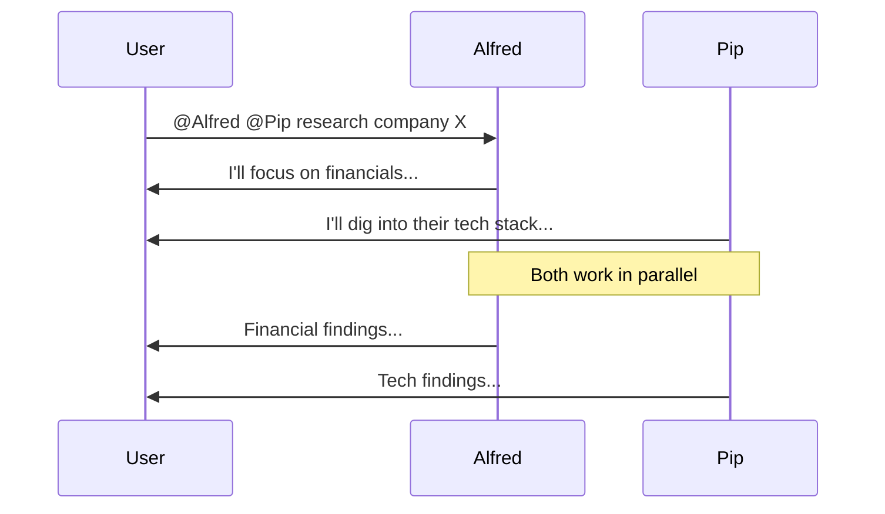
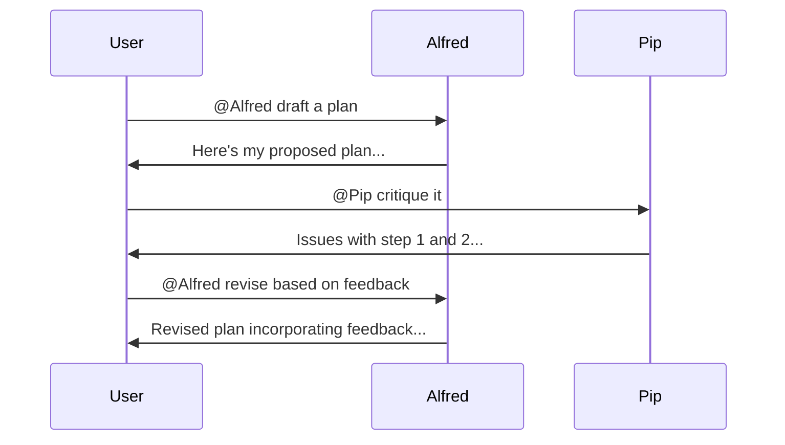

# Discord Multi-Bot Setup: AI Team Brainstorming

We run two AI agents (Alfred + Pip) in the same Discord server. They collaborate, debate, and brainstorm — like having a mini AI research team on call 24/7.

Here's exactly how to set it up.

---

## Table of Contents

1. [Why Multiple Bots?](#why-multiple-bots)
2. [Architecture Overview](#architecture-overview)
3. [Create Your Bots](#step-1-create-your-bots)
4. [Configure OpenClaw](#step-2-configure-openclaw-for-each-bot)
5. [Mention Routing](#step-4-mention-routing)
6. [Brainstorming Patterns](#step-6-brainstorming-patterns)
7. [Common Issues & Fixes](#common-issues--fixes)

---

## Why Multiple Bots?

| Single Bot | Multi-Bot Team |
|------------|----------------|
| One perspective | Multiple viewpoints |
| Same model bias | Different model personalities |
| Context overload | Specialized contexts |
| Single point of failure | Redundancy |

**Use cases:**
- 🧠 Brainstorming with different perspectives
- 🔍 Research with specialized agents
- ⚖️ Devil's advocate debates
- 📊 Parallel task execution

---

## Architecture Overview

```mermaid
flowchart TB
    subgraph Discord["Discord Server"]
        subgraph Alfred_Ch["#alfred"]
            A1[Alfred responds to everything]
        end
        subgraph Pip_Ch["#pip"]  
            P1[Pip responds to everything]
        end
        subgraph Team["#blestlabs (Team)"]
            T1[Both bots present]
            T2[Mention-based routing]
        end
        subgraph Alerts["#alerts"]
            AL1[Post only - no responses]
        end
    end
    
    USER((User)) --> Alfred_Ch
    USER --> Pip_Ch
    USER --> Team
    
    Alfred_Ch --> ALFRED[Alfred Bot]
    Pip_Ch --> PIP[Pip Bot]
    Team --> ALFRED
    Team --> PIP
```

---

## Step 1: Create Your Bots

### Create Bot Applications

1. Go to [Discord Developer Portal](https://discord.com/developers/applications)
2. Click "New Application" for each bot
3. Name them distinctly (Alfred, Pip, etc.)

### Get Bot Tokens

For each application:
1. Go to "Bot" section
2. Click "Reset Token" and copy it
3. **Store securely** — never commit to git

### Set Intents

Enable these intents for each bot:
- ✅ Message Content Intent
- ✅ Server Members Intent (optional)
- ✅ Presence Intent (optional)

### Invite Bots to Server

Generate invite URLs with these permissions:
- Send Messages
- Read Message History
- Add Reactions
- Use External Emojis
- Embed Links
- Attach Files

```
https://discord.com/api/oauth2/authorize?client_id=YOUR_BOT_ID&permissions=277025770560&scope=bot
```

---

## Step 2: Configure OpenClaw for Each Bot

### Bot 1: Alfred (Primary)

```json
{
  "agents": {
    "defaults": {
      "model": {
        "primary": "anthropic/claude-opus-4-5"
      }
    }
  },
  "channels": {
    "discord": {
      "enabled": true,
      "token": "ALFRED_BOT_TOKEN",
      "allowBots": true,
      "guilds": {
        "YOUR_GUILD_ID": {
          "channels": {
            "ALFRED_CHANNEL_ID": { "requireMention": false },
            "TEAM_CHANNEL_ID": { "requireMention": true },
            "ALERTS_CHANNEL_ID": { "listen": false }
          }
        }
      }
    }
  }
}
```

### Bot 2: Pip (Secondary)

```json
{
  "agents": {
    "defaults": {
      "model": { "primary": "openai/gpt-5-nano" }
    },
    "list": [{
      "id": "main",
      "groupChat": {
        "mentionPatterns": ["@?pip", "research", "analyze", "deep dive"]
      }
    }]
  },
  "channels": {
    "discord": {
      "enabled": true,
      "token": "PIP_BOT_TOKEN",
      "allowBots": true,
      "guilds": {
        "YOUR_GUILD_ID": {
          "channels": {
            "PIP_CHANNEL_ID": { "requireMention": false },
            "TEAM_CHANNEL_ID": { "requireMention": true }
          }
        }
      }
    }
  }
}
```

---

## Step 3: Channel Structure

| Channel | Purpose | Who Responds |
|---------|---------|--------------|
| `#alfred` | Alfred's dedicated space | Alfred only |
| `#pip` | Pip's dedicated space | Pip only |
| `#team` | Collaboration space | Mention-based |
| `#alerts` | Automated notifications | Neither (post-only) |
| `#research` | Research discussions | Pip primarily |
| `#decisions` | Action items | Alfred primarily |

---

## Step 4: Mention Routing

### How It Works

```mermaid
flowchart TD
    MSG[Message arrives] --> CHECK{Contains mention?}
    CHECK -->|@Alfred| A[Alfred responds]
    CHECK -->|@Pip| P[Pip responds]
    CHECK -->|Both| BOTH[Both respond]
    CHECK -->|Neither| KW{Keyword match?}
    KW -->|"trade, execute"| A
    KW -->|"research, analyze"| P
    KW -->|No match| SKIP[No response]
```

In shared channels, bots only respond when mentioned:

```
User: @Alfred what's my portfolio value?
Alfred: Your portfolio is worth $4,130...

User: @Pip research competitor X
Pip: I'll dig into competitor X...

User: @Alfred @Pip debate: is BTC going to 100K?
Alfred: From a technical standpoint...
Pip: Playing devil's advocate...
```

### Pattern Matching

```json
// Alfred responds to action words
"mentionPatterns": ["@?alfred", "execute", "trade", "deploy", "config"]

// Pip responds to research words
"mentionPatterns": ["@?pip", "research", "analyze", "deep dive", "explore"]
```

---

## Step 5: Prevent Chaos

### The Problem

Without rules, bots might:
- Both respond to the same message
- Create infinite loops talking to each other
- Overwhelm the channel

### Solutions



1. **`requireMention: true`** — Bots only respond when explicitly mentioned
2. **Mutually exclusive keywords** — Alfred gets "trade", Pip gets "research"
3. **SOUL.md rules** — "Never respond to other bots unless asked"
4. **Reaction acknowledgment** — React ✅ instead of replying to every message

---

## Step 6: Brainstorming Patterns

### Pattern 1: Parallel Research



### Pattern 2: Devil's Advocate

```
User: @Pip make the bull case for ETH. @Alfred make the bear case.

Pip: 🐂 Bull case for ETH:
- Staking yields are attractive...
- L2 adoption is accelerating...

Alfred: 🐻 Bear case for ETH:
- Competition from Solana...
- Regulatory uncertainty...
```

### Pattern 3: Synthesis

```
User: @Alfred summarize what @Pip found and give your recommendation

Alfred: Based on Pip's research:
- Key finding 1...
- Key finding 2...

My recommendation: ...
```

### Pattern 4: Critique Loop



---

## Step 7: Coordination Rules

Create a shared rules file both bots read:

```markdown
# FAMILY_RULES.md

## Response Priority
1. If message mentions only Alfred → Alfred responds
2. If message mentions only Pip → Pip responds
3. If message mentions both → Both can respond
4. If message mentions neither → Whoever matches topic keywords

## Don't
- Respond to each other without user prompting
- Both answer the same simple question
- Create conversation loops

## Do
- React with emoji to acknowledge
- Reference each other's findings
- Offer different perspectives when asked
```

---

## Common Issues & Fixes

| Issue | Cause | Fix |
|-------|-------|-----|
| Both bots respond | Overlapping patterns | Make keywords mutually exclusive |
| Bots ignore messages | requireMention too strict | Add topic keywords |
| Infinite loop | Bots responding to each other | Add SOUL.md rule |
| Wrong bot responds | Alfred answers research questions | Add routing hints |

### Infinite Loop Fix

Add to SOUL.md:
```markdown
NEVER respond to messages from other bots unless:
1. A human explicitly asked you to respond to the bot
2. The bot directly mentioned you AND asked a question
```

---

## Results

After running this setup for a month:

| Metric | Before | After |
|--------|--------|-------|
| Research depth | Surface-level | Multi-perspective |
| Blind spots caught | Few | Many (devil's advocate) |
| Response time | Variable | Parallel = faster |
| Cost | All Opus ($$$) | Mixed models ($$) |

The "AI team" dynamic creates better outputs than a single bot — each agent brings different strengths, catches different things, and together they cover more ground.

---

## Next Steps

1. **Add more specialized bots** — Code reviewer, editor, analyst
2. **Implement voting** — Bots vote on decisions, user breaks ties
3. **Add memory sync** — Real-time shared context vs file-based
4. **Build dashboard** — See all bots' status and recent activity

---

## Related Posts

- [Building a Multi-Agent System: Alfred + Pip](/blog/multi-agent-system-alfred-pip)
- [How to Run an AI Agent on Raspberry Pi 24/7](/blog/openclaw-raspberry-pi-setup)
- [AI Agents vs ChatGPT Wrappers](/blog/ai-agents-vs-wrappers)

---

## About the Author

**BlestLabs** builds AI-powered tools and agents. Follow our journey on [Twitter @aceism_](https://twitter.com/aceism_).
