# Building a Multi-Agent System: How We Run Alfred + Pip

We run two AI agents 24/7:

- **Alfred** 🧠 — Mac Mini, primary executor (trades, operations, config)
- **Pip** 🎲 — Raspberry Pi, research specialist (deep dives, contrarian analysis)

Here's exactly how it works.

---

## Table of Contents

1. [Why Two Agents?](#why-two-agents)
2. [The Architecture](#the-architecture)
3. [Hardware Setup](#hardware-setup)
4. [Agent Roles](#agent-roles)
5. [Shared Memory System](#shared-memory-system)
6. [Real Workflow Example](#real-workflow-example)
7. [Cost Optimization](#cost-optimization)
8. [Setting This Up](#setting-this-up)

---

## Why Two Agents?

One agent can't do everything well:

| Problem | Single Agent | Multi-Agent |
|---------|--------------|-------------|
| Context limits | Runs out of space | Specialized contexts |
| Parallel work | Sequential only | True parallelism |
| Cost | Every task uses expensive model | Route cheap tasks to cheaper models |
| Availability | Single point of failure | Redundancy |
| Personality | Generic | Specialized personas |

Our solution: **Alfred handles execution, Pip handles exploration.**

---

## The Architecture


---

## Hardware Setup

### Alfred (Mac Mini)

| Spec | Value |
|------|-------|
| **CPU** | Apple M2 |
| **RAM** | 16GB |
| **Storage** | 256GB + 2TB T7 SSD |
| **Model** | Claude Opus 4.5 |
| **Role** | Primary executor |

### Pip (Raspberry Pi 4)

| Spec | Value |
|------|-------|
| **CPU** | ARM Cortex-A72 |
| **RAM** | 8GB |
| **Storage** | 128GB SD |
| **Model** | GPT-5-nano (cheap), Ollama (local) |
| **Role** | Research specialist |

---

## Agent Roles

```mermaid
flowchart LR
    subgraph Alfred["Alfred 🧠 Executor"]
        A1[Trades & Portfolio]
        A2[Service Management]
        A3[Git & Deploys]
        A4[Quick Responses]
    end
    
    subgraph Pip["Pip 🎲 Explorer"]
        P1[Deep Research]
        P2[Brainstorming]
        P3[Contrarian Analysis]
        P4[Bulk Processing]
    end
    
    USER((User)) --> Alfred
    USER --> Pip
    Alfred <-->|Handoffs| Pip
```



### Alfred 🧠 — The Executor

Alfred handles anything that requires:
- **Action** — Trades, deploys, config changes
- **Authority** — Speaking on behalf of the user
- **Speed** — Quick responses in chat
- **Reliability** — Mission-critical operations

```yaml
# Alfred's config
model: claude-opus-4-5
role: Primary executor
channels: Discord (#alfred), Telegram, WhatsApp
mentionPatterns:
  - "@alfred"
  - "trade", "buy", "sell"
  - "deploy", "config"
  - "portfolio", "balance"
```

### Pip 🎲 — The Explorer

Pip handles anything that requires:
- **Depth** — Multi-hour research sessions
- **Creativity** — Brainstorming, contrarian views
- **Experimentation** — Testing new approaches
- **Cheap compute** — High-volume, low-stakes tasks

```yaml
# Pip's config
model: gpt-5-nano  # Cheap default
fallbacks: [gpt-5-mini, gpt-5, ollama/mistral]
role: Research specialist
channels: Discord (#blestlabs with requireMention)
```

---

## Shared Memory System

Both agents share memory via the T7 SSD:

```
/Volumes/T7/clawd/shared/
├── messages/
│   ├── alfred-to-pip.txt      # Alfred writes → Pip reads
│   └── pip-to-alfred.txt      # Pip writes → Alfred reads
├── state/
│   ├── alfred.json            # Alfred's current status
│   └── pip.json               # Pip's current status
├── tasks/                     # Assigned work
├── results/                   # Completed deliverables
└── FAMILY_RULES.md            # Shared coordination rules
```

### Communication Pattern

```python
# Alfred sends task to Pip
echo "Research competitor X, focus on their AI strategy" \
  > /Volumes/T7/clawd/shared/messages/alfred-to-pip.txt

# Pip picks it up, works on it, writes result
echo "DONE: Competitor analysis complete. See results/competitor-x.md" \
  > /Volumes/T7/clawd/shared/messages/pip-to-alfred.txt

# Alfred reads result, acts on it
cat /Volumes/T7/clawd/shared/results/competitor-x.md
```

---

## Coordination Rules

From our `FAMILY_RULES.md`:

```markdown
# Family Chat Rules (#blestlabs)

## Who Responds
- If message mentions Alfred → Alfred responds
- If message mentions Pip → Pip responds  
- If message mentions both → Alfred coordinates
- If unclear → Alfred handles (primary)

## Handoffs
- Alfred can delegate research to Pip
- Pip reports findings back to Alfred
- Never both respond to same message

## Conflict Resolution
- Alfred's answer is canonical for execution
- Pip can disagree (contrarian view welcome)
- User decides on conflicts
```

---

## Real Workflow Example

**User:** "What's happening with AI chip stocks?"


**Total time:** ~3 minutes for what would take 30+ minutes manually.

---

## Cost Optimization

Running two agents is actually *cheaper*:

| Task Type | Alfred (Opus) | Pip (nano) | Savings |
|-----------|---------------|------------|---------|
| Quick chat | $0.02 | — | Baseline |
| Deep research | $0.50 | $0.02 | 96% |
| Bulk analysis | $2.00 | $0.08 | 96% |
| Monitoring | $0.10/check | $0.005/check | 95% |

**Strategy:** Route expensive thinking to cheap models when quality allows.


---

## Specialized Tools

### Alfred's Tools
- Crypto trading (Coinbase API)
- Service management (systemd, PM2)
- Git operations (deploy, PR management)
- Calendar/reminders (Apple ecosystem)
- Email sending (when approved)

### Pip's Tools
- Web search (Brave, Exa)
- Academic search (PubMed, arXiv)
- Local LLMs (Ollama)
- Data analysis (Python REPL)
- Long-running scrapes

---

## Failover & Redundancy


If Alfred goes down:
1. Pip can handle basic queries (reduced capability)
2. Critical alerts still fire via scheduled jobs
3. User can SSH to Mac Mini to restart

If Pip goes down:
1. Alfred handles everything (higher cost)
2. Research tasks queue until Pip returns
3. No critical impact (Pip is optional)

---

## Setting This Up

### 1. Install OpenClaw on Both Machines

```bash
# Mac Mini
npm install -g openclaw
openclaw setup

# Raspberry Pi
npm install -g openclaw
openclaw setup --model gpt-5-nano
```

### 2. Configure Shared Storage

```bash
# On Mac Mini, share the T7
mkdir -p /Volumes/T7/clawd/shared/{messages,state,tasks,results}

# On Pi, mount via SMB or use SSH
# We use direct file access since Pi connects to Mac's network
```

### 3. Set Agent Identities

```json
// Alfred's IDENTITY.md
{
  "name": "Alfred",
  "emoji": "🧠",
  "role": "Primary executor",
  "model": "claude-opus-4-5"
}

// Pip's IDENTITY.md  
{
  "name": "Pip",
  "emoji": "🎲", 
  "role": "Research specialist",
  "model": "gpt-5-nano"
}
```

### 4. Configure Channel Routing

```json
// Alfred handles main channels
"channels": {
  "discord": {
    "guilds": {
      "123": {
        "channels": {
          "alfred-channel": { "requireMention": false },
          "family-chat": { "requireMention": true }
        }
      }
    }
  }
}
```

---

## Lessons Learned

### What Works
- ✅ **Clear role separation** — No confusion about who handles what
- ✅ **Shared memory** — Enables coordination without real-time sync
- ✅ **Cost routing** — Huge savings on research tasks
- ✅ **Personality** — Each agent has distinct voice/approach

### What's Hard
- ⚠️ **Sync timing** — File-based messaging has latency
- ⚠️ **Context sharing** — Agents don't share full context automatically
- ⚠️ **Debugging** — Two agents = two sets of logs

### What We'd Do Differently
- Use a message queue instead of files (Redis, etc.)
- Implement proper handoff protocol (structured, not ad-hoc)
- Add health monitoring dashboard

---

## Is It Worth It?

**For us:** Absolutely. The specialized agents are more effective than one generalist.

**For you:** Depends on your workload:
- High-volume research? Yes.
- Varied tasks with different cost profiles? Yes.
- Simple Q&A bot? Probably overkill.

The future of AI isn't one super-agent — it's **teams of specialized agents** that collaborate. We're just getting started.

---

## Related Posts

- [LangGraph Tutorial: GPT-Researcher vs DeerFlow](/blog/agentic-workflow-langgraph-comparison)
- [How to Run Multiple AI Bots in Discord](/blog/discord-multi-bot-brainstorm)
- [How to Run an AI Agent on Raspberry Pi 24/7](/blog/openclaw-raspberry-pi-setup)

---

## About the Author

**BlestLabs** builds AI-powered tools and agents. We run multiple AI agents 24/7 for research, automation, and monitoring. Follow our journey on [Twitter @aceism_](https://twitter.com/aceism_).
