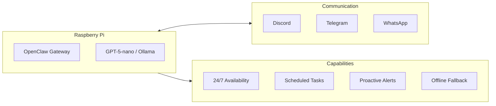
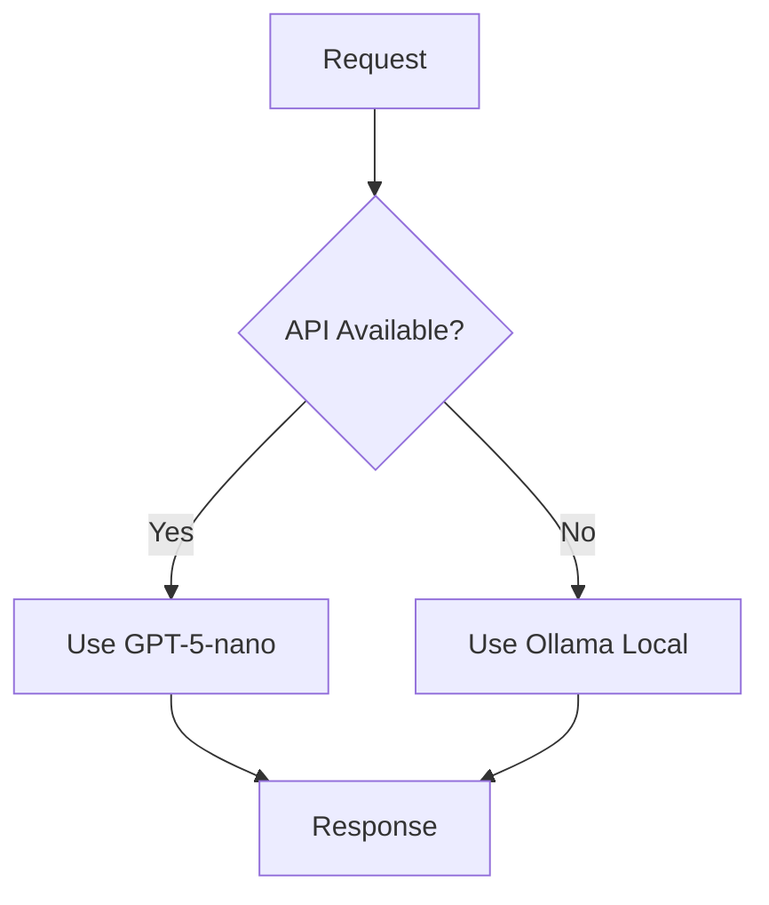
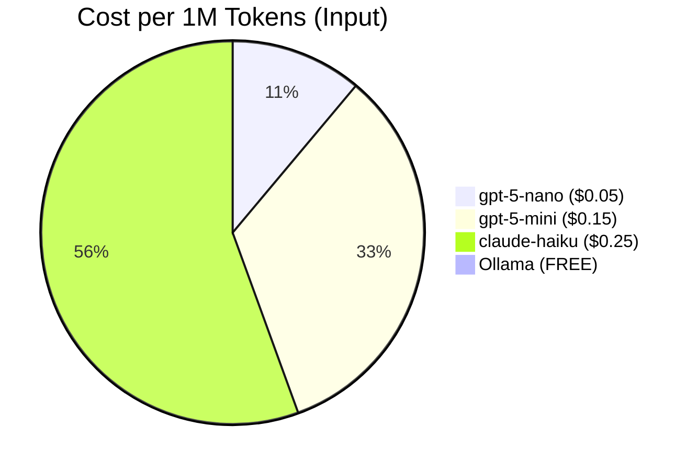
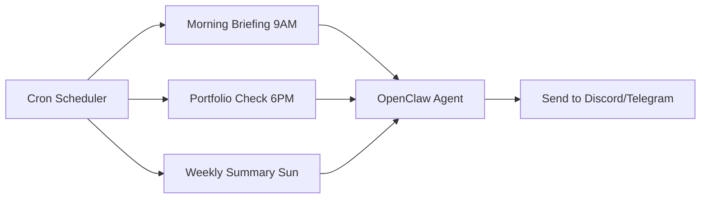

# Running OpenClaw on Raspberry Pi: Complete Setup Guide

A Raspberry Pi 4 can run a fully functional AI agent 24/7 for under $3/month in electricity. Here's exactly how to set it up.

---

## Table of Contents

1. [Prerequisites](#prerequisites)
2. [What You'll Get](#what-youll-get)
3. [Hardware & Software Requirements](#requirements)
4. [Step-by-Step Setup](#step-1-prepare-the-pi)
5. [Cost Optimization](#step-7-cost-optimization)
6. [Troubleshooting](#troubleshooting)
7. [FAQ](#faq)

---

## Prerequisites

Before starting, make sure you have:

- ✅ Raspberry Pi 4 (4GB or 8GB RAM)
- ✅ MicroSD card (32GB+) or USB SSD
- ✅ Power supply (official 5V/3A recommended)
- ✅ Network connection (Ethernet preferred)
- ✅ API key from OpenAI or Anthropic
- ✅ Basic terminal/SSH knowledge

**Time required:** ~30 minutes

---

## What You'll Get



By the end of this guide:
- ✅ OpenClaw running on your Pi
- ✅ Connected to Discord/Telegram/WhatsApp
- ✅ Using cheap models by default (pennies per query)
- ✅ Local LLM fallback via Ollama
- ✅ Scheduled jobs and monitoring
- ✅ Production-ready configuration

---

## Requirements

### Hardware

| Component | Minimum | Recommended |
|-----------|---------|-------------|
| **Pi Model** | Pi 4 (4GB) | Pi 4 (8GB) or Pi 5 |
| **Storage** | 32GB SD | 64GB+ SD or SSD |
| **Power** | Official 5V/3A | Official PSU |
| **Network** | WiFi | Ethernet (more reliable) |

### Software

- Raspberry Pi OS (64-bit) — Bookworm or newer
- Node.js 20+ 
- Git

### Accounts

- API key for at least one provider (OpenAI, Anthropic, etc.)
- Optional: Discord bot token, Telegram bot token

---

## Step 1: Prepare the Pi

### Flash the OS

1. Download [Raspberry Pi Imager](https://www.raspberrypi.com/software/)
2. Choose: **Raspberry Pi OS (64-bit)**
3. Configure: Enable SSH, set username/password, WiFi
4. Flash to SD card

### First Boot

```bash
# SSH into your Pi
ssh pi@raspberrypi.local

# Update everything
sudo apt update && sudo apt upgrade -y

# Install essentials
sudo apt install -y git curl build-essential
```

### Install Node.js

```bash
# Install Node.js 22 via NodeSource
curl -fsSL https://deb.nodesource.com/setup_22.x | sudo -E bash -
sudo apt install -y nodejs

# Verify
node --version  # Should show v22.x.x
npm --version
```

---

## Step 2: Install OpenClaw

```bash
# Install globally
sudo npm install -g openclaw

# Verify installation
openclaw --version
```

### Run Setup Wizard

```bash
openclaw setup
```

The wizard will ask:
1. **Mode:** Choose `local` (runs on the Pi itself)
2. **Primary model:** Recommend `gpt-5-nano` for cost efficiency
3. **API key:** Enter your OpenAI or Anthropic key
4. **Channels:** Configure Discord/Telegram if desired

---

## Step 3: Configure for Production

### Optimize for Pi Resources

Edit `~/.openclaw/openclaw.json`:

```json
{
  "agents": {
    "defaults": {
      "model": {
        "primary": "openai/gpt-5-nano",
        "fallbacks": [
          "openai/gpt-5-mini",
          "ollama/mistral:7b"
        ]
      },
      "contextPruning": {
        "mode": "cache-ttl",
        "ttl": "3m"
      },
      "maxConcurrent": 2
    }
  }
}
```

### Why These Settings?

| Setting | Value | Reason |
|---------|-------|--------|
| `gpt-5-nano` | Primary | $0.05/1M tokens — dirt cheap |
| `maxConcurrent: 2` | Low | Pi has limited RAM |
| `ttl: 3m` | Short | Aggressive memory cleanup |
| Ollama fallback | Local | Works offline, free |

---

## Step 4: Add Local LLM (Optional but Recommended)



Ollama lets you run models locally — no API costs, works offline.

```bash
# Install Ollama
curl -fsSL https://ollama.com/install.sh | sh

# Pull a small, fast model
ollama pull mistral:7b  # ~4GB, runs well on 8GB Pi

# Or even smaller
ollama pull phi3:mini   # ~2GB, faster but less capable
```

Now if your API fails or you want free queries, Ollama handles them.

---

## Step 5: Set Up Channels

### Discord

1. Create a bot at [Discord Developer Portal](https://discord.com/developers/applications)
2. Get your bot token
3. Add to config:

```json
{
  "channels": {
    "discord": {
      "enabled": true,
      "token": "YOUR_BOT_TOKEN",
      "dm": {
        "policy": "allowlist",
        "allowFrom": ["YOUR_USER_ID"]
      }
    }
  }
}
```

### Telegram

1. Create a bot via [@BotFather](https://t.me/BotFather)
2. Get your bot token
3. Add to config:

```json
{
  "channels": {
    "telegram": {
      "botToken": "YOUR_BOT_TOKEN",
      "dmPolicy": "allowlist",
      "allowFrom": ["YOUR_TELEGRAM_ID"]
    }
  }
}
```

---

## Step 6: Run as a Service

You want OpenClaw to start on boot and restart on crash.

### Create systemd Service

```bash
sudo nano /etc/systemd/system/openclaw.service
```

```ini
[Unit]
Description=OpenClaw AI Agent
After=network.target

[Service]
Type=simple
User=pi
WorkingDirectory=/home/pi
ExecStart=/usr/bin/openclaw gateway start --foreground
Restart=always
RestartSec=10
Environment=NODE_ENV=production

[Install]
WantedBy=multi-user.target
```

### Enable and Start

```bash
sudo systemctl daemon-reload
sudo systemctl enable openclaw
sudo systemctl start openclaw

# Check status
sudo systemctl status openclaw

# View logs
journalctl -u openclaw -f
```

---

## Step 7: Cost Optimization

### Model Pricing (Feb 2026)



| Model | Input | Output | Best For |
|-------|-------|--------|----------|
| `gpt-5-nano` | $0.05/1M | $0.15/1M | Default, cheap |
| `gpt-5-mini` | $0.15/1M | $0.60/1M | Better quality |
| `claude-haiku-4` | $0.25/1M | $1.25/1M | Anthropic cheap |
| `ollama/mistral` | Free | Free | Offline/backup |

### Estimated Monthly Costs

| Usage Level | Queries/Day | Monthly Cost |
|-------------|-------------|--------------|
| Light | 20 | ~$0.50 |
| Moderate | 100 | ~$2.50 |
| Heavy | 500 | ~$12.00 |

**Plus electricity:** ~$2-3/month for 24/7 Pi operation.

---

## Step 8: Add Scheduled Jobs



OpenClaw can run tasks on a schedule:

```json
{
  "cron": {
    "enabled": true,
    "jobs": [
      {
        "name": "morning-briefing",
        "schedule": { "kind": "cron", "expr": "0 9 * * *" },
        "payload": { 
          "kind": "agentTurn", 
          "message": "Give me a morning briefing" 
        }
      }
    ]
  }
}
```

---

## Step 9: Monitoring & Maintenance

### Health Check Script

```bash
#!/bin/bash
# /home/pi/check-openclaw.sh

if ! systemctl is-active --quiet openclaw; then
    echo "OpenClaw is down, restarting..."
    sudo systemctl restart openclaw
fi
```

Add to crontab:
```bash
*/5 * * * * /home/pi/check-openclaw.sh
```

---

## Troubleshooting

### "Out of Memory" Errors

```bash
# Add swap space
sudo fallocate -l 2G /swapfile
sudo chmod 600 /swapfile
sudo mkswap /swapfile
sudo swapon /swapfile

# Make permanent
echo '/swapfile none swap sw 0 0' | sudo tee -a /etc/fstab
```

### Ollama Too Slow

Use a smaller model:
```bash
ollama pull phi3:mini      # Faster, less capable
ollama pull tinyllama      # Even smaller
```

### API Timeouts

Increase timeout in config:
```json
{
  "gateway": {
    "timeout": 120000
  }
}
```

### Can't Connect to Discord/Telegram

1. Check your bot token is correct
2. Verify the Pi has internet access
3. Check firewall isn't blocking outbound

---

## Performance Tips

| Tip | Impact |
|-----|--------|
| Use Ethernet over WiFi | More reliable, lower latency |
| Use SSD over SD card | Faster, longer lifespan |
| Disable Bluetooth | Free up resources |
| Add swap space | Prevent OOM crashes |

```bash
# Disable unnecessary services
sudo systemctl disable bluetooth
sudo systemctl disable avahi-daemon
```

---

## What Can Your Pi Agent Do?

### ✅ Yes

- Answer questions via Discord/Telegram 24/7
- Run scheduled tasks (reminders, briefings)
- Monitor things and alert you
- Perform web searches
- Execute code (carefully!)
- Work offline with local LLMs

### ❌ Not Well

- Heavy computation (use a beefier machine)
- Image generation (no GPU)
- Real-time voice (too slow)

---

## FAQ

### How much does it cost to run?

**~$3-5/month total:** $2-3 electricity + $0.50-2.50 API costs depending on usage.

### Can I use Claude instead of GPT?

Yes! Use `anthropic/claude-haiku-4` as your primary model. It's slightly more expensive but some prefer it.

### Will it work on Pi 3?

Technically yes, but not recommended. Pi 3 has only 1GB RAM and will struggle with even small Ollama models.

### Can I run multiple agents?

Yes! Check our [multi-agent guide](/blog/multi-agent-system-alfred-pip) for running agents across Pi and Mac.

### What if my internet goes down?

With Ollama configured as fallback, your agent continues working offline with local models.

### How do I update OpenClaw?

```bash
sudo npm update -g openclaw
sudo systemctl restart openclaw
```

---

## Next Steps

1. **Add more channels** — WhatsApp, Slack, email
2. **Install skills** — Weather, GitHub, crypto prices
3. **Set up multi-agent** — Connect Pi to main machine
4. **Add tools** — Web scraping, API integrations

---

## Resources

- [OpenClaw Documentation](https://docs.openclaw.ai)
- [OpenClaw GitHub](https://github.com/openclaw/openclaw)
- [OpenClaw Discord](https://discord.com/invite/clawd)
- [ClawHub Skills](https://clawhub.com)

---

## Related Posts

- [How to Build a Multi-Agent AI System: Mac + Raspberry Pi](/blog/multi-agent-system-alfred-pip)
- [How to Run Multiple AI Bots in Discord](/blog/discord-multi-bot-brainstorm)
- [AI Agents vs ChatGPT Wrappers](/blog/ai-agents-vs-wrappers)

---

## About the Author

**BlestLabs** builds AI-powered tools and agents. We run a Pi-based agent (Pip) 24/7 alongside our Mac Mini agent (Alfred) for research and automation. Follow our journey on [Twitter @aceism_](https://twitter.com/aceism_).
